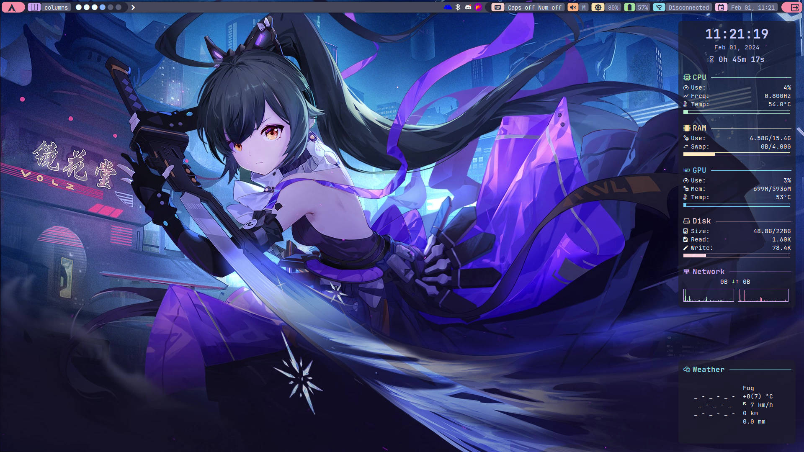
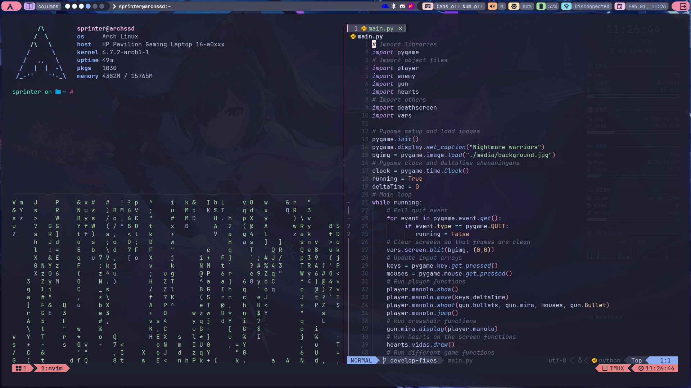

# Sprinter05 Dotfiles
---
This repository contains all my Linux ricing dotfiles for alacritty, conky, neovim, qtile and tmux. They are all based on the [catppuccin](https://github.com/catppuccin/catppuccin) color palette (specially the Mocha and Macchiato variants) so some files are their own example ones modified to my likings. I have also included some screenshots so you can see how it looks for yourself.
## Inspiration
I have taken inspiration in other people's dotfiles and have used some of their files modifying them for my purpose. I believe they are all credited in the file comments but if you recognise the file and it is not being credited let me know so I can add it because I may have forgotten!
## Disclaimer
These dotfiles are not 100% finished and may be modified in the future, so I will try to upload any changes I make to these files from time to time. If you have any issues implementing these files in your system please post an issue and I will try to see whats the problem.
# Screenshots
---
## Qtile and Conky

## Tmux and Neovim

